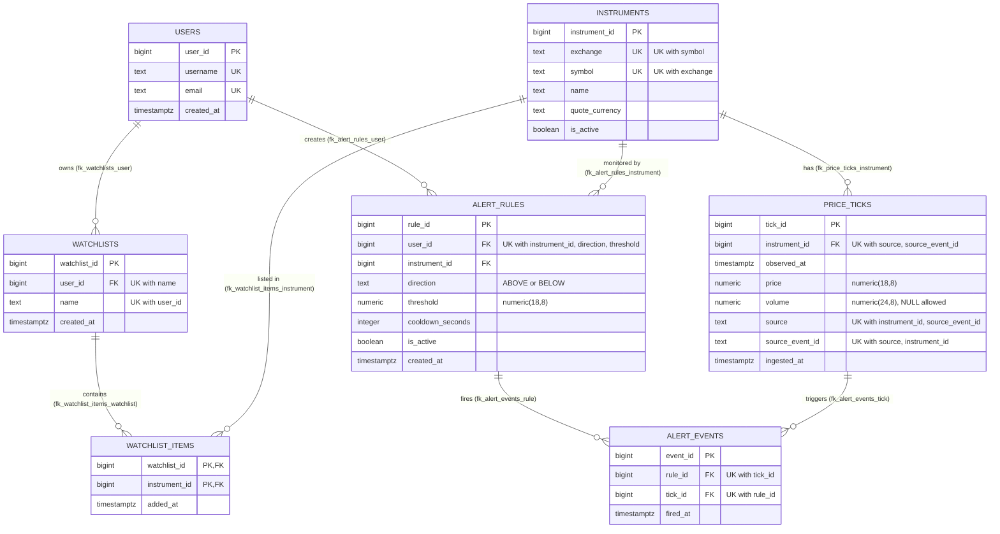

# ER Diagram — stock_watchlist (live schema)

Verified against the PostgreSQL 18.6 catalog on 2026-09-25 with
`sql/verify_spec.sql` (0 column, 0 constraint and 0 object mismatches).
Each relationship line below comes from exactly one FOREIGN KEY in
`pg_constraint`. No other relationships are drawn.

## Diagram



How to export an image of it:
- Paste the block into https://mermaid.live and use Actions → PNG or SVG.
- Or use a Mermaid preview extension in VS Code.

## Notation

| Symbol | Meaning |
|---|---|
| `\|\|` on the parent side | exactly one parent (FK column is NOT NULL) |
| `o{` on the child side | zero or more children |
| PK | primary key |
| FK | foreign key |
| UK | column is part of a UNIQUE constraint (alternate / candidate key) |

## Relationship verification (from the catalog)

| # | Parent | Child | FK constraint | FK column | FK column unique alone? | Cardinality | Child participation | ON DELETE |
|---|---|---|---|---|---|---|---|---|
| 1 | users | watchlists | fk_watchlists_user | user_id | no | 1 : 0..N | exactly 1 parent | CASCADE |
| 2 | users | alert_rules | fk_alert_rules_user | user_id | no | 1 : 0..N | exactly 1 parent | CASCADE |
| 3 | watchlists | watchlist_items | fk_watchlist_items_watchlist | watchlist_id | no (part of composite PK) | 1 : 0..N | exactly 1 parent | CASCADE |
| 4 | instruments | watchlist_items | fk_watchlist_items_instrument | instrument_id | no (part of composite PK) | 1 : 0..N | exactly 1 parent | RESTRICT |
| 5 | instruments | price_ticks | fk_price_ticks_instrument | instrument_id | no | 1 : 0..N | exactly 1 parent | RESTRICT |
| 6 | instruments | alert_rules | fk_alert_rules_instrument | instrument_id | no | 1 : 0..N | exactly 1 parent | RESTRICT |
| 7 | alert_rules | alert_events | fk_alert_events_rule | rule_id | no (part of composite UK) | 1 : 0..N | exactly 1 parent | CASCADE |
| 8 | price_ticks | alert_events | fk_alert_events_tick | tick_id | no (part of composite UK) | 1 : 0..N | exactly 1 parent | RESTRICT |

How each column was decided:
- **Cardinality** is `1 : 0..1` only when the FK column(s) carry a UNIQUE
  index by themselves. None do, so every relationship is `1 : 0..N`.
- **Child participation** comes from `pg_attribute.attnotnull`. Every FK
  column is NOT NULL, so every child row must have exactly one parent.
- **Parent participation** is optional in every case (`o{`). No
  constraint forces a parent to have children, e.g. a user may have 0
  watchlists.

## Derived many-to-many relationships

These are not direct FKs. They exist through a junction table.

| M:N | Through | Meaning |
|---|---|---|
| watchlists M:N instruments | watchlist_items (relationships 3 + 4) | a list holds many instruments; an instrument is on many lists |
| alert_rules M:N price_ticks | alert_events (relationships 7 + 8) | a rule fires on many ticks; one tick can fire many rules; a (rule, tick) pair occurs at most once (`uq_alert_events_rule_tick`) |

## Not drawn, because no FK exists

- users → instruments directly. That link exists only through watchlists
  and watchlist_items, or through alert_rules.
- alert_events → instruments. That link is reached through tick_id, or
  through rule_id. The Phase 4 integrity trigger will require both paths
  to reach the same instrument; it is a rule, not a relationship.

## Re-verify

```sh
psql -d stock_watchlist -v ON_ERROR_STOP=1 -f sql/verify_spec.sql
```
Section 4 of the output is the relationship table above, read directly
from `pg_constraint`, `pg_index` and `pg_attribute`.
