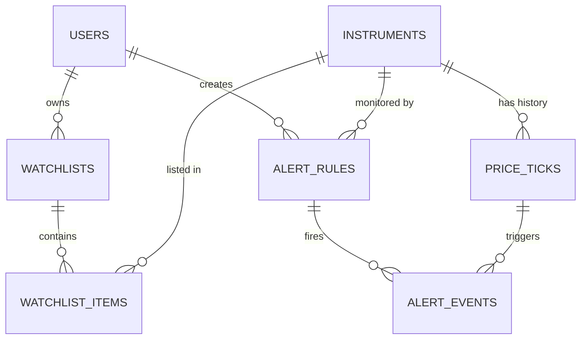

# Phase 1 Specification — APPROVED

Real-Time Stock Market Watchlist & Alert System — BCSE302P.
This is the approved database design. The live schema
(`sql/00_schema.sql`) implements sections A–E. Sections I–J describe
Phase 4 work that has not been built yet.

All columns are NOT NULL unless marked **NULL**.
"identity" = `BIGINT GENERATED ALWAYS AS IDENTITY`.

---

## A–C. Tables, columns, keys, constraints, nullability, defaults

### users
| Column | Type | Default |
|---|---|---|
| user_id | identity | |
| username | TEXT | |
| email | TEXT | |
| created_at | TIMESTAMPTZ | now() |

- PK `pk_users` (user_id)
- UNIQUE `uq_users_username` (username); `uq_users_email` (email)
- CHECK `ck_users_username_format`: `username ~ '^[a-z0-9_]{3,30}$'`
- CHECK `ck_users_email_format`: `email = lower(email) AND email LIKE '%_@_%'`
- Candidate keys: {user_id}, {username}, {email}

### instruments
| Column | Type | Default |
|---|---|---|
| instrument_id | identity | |
| exchange | TEXT | |
| symbol | TEXT | |
| name | TEXT | |
| quote_currency | TEXT | |
| is_active | BOOLEAN | true |

- PK `pk_instruments` (instrument_id)
- UNIQUE `uq_instruments_exchange_symbol` (exchange, symbol)
- CHECK `ck_instruments_exchange`: IN ('NSE','BSE','BINANCE')
- CHECK `ck_instruments_symbol_format`: `^[A-Z0-9&._-]{1,20}$`
- CHECK `ck_instruments_name_not_blank`: `btrim(name) <> ''`
- CHECK `ck_instruments_quote_currency`: `^[A-Z]{3,5}$`
- Candidate keys: {instrument_id}, {exchange, symbol}
- No asset_class column (exchange → asset_class would violate 3NF)

### watchlists
| Column | Type | Default |
|---|---|---|
| watchlist_id | identity | |
| user_id | BIGINT | |
| name | TEXT | |
| created_at | TIMESTAMPTZ | now() |

- PK `pk_watchlists` (watchlist_id)
- FK `fk_watchlists_user` → users
- UNIQUE `uq_watchlists_user_name` (user_id, name)
- CHECK `ck_watchlists_name`: not blank, ≤ 50 chars
- Candidate keys: {watchlist_id}, {user_id, name}

### watchlist_items
| Column | Type | Default |
|---|---|---|
| watchlist_id | BIGINT | |
| instrument_id | BIGINT | |
| added_at | TIMESTAMPTZ | now() |

- PK `pk_watchlist_items` (watchlist_id, instrument_id)
- FK `fk_watchlist_items_watchlist` → watchlists
- FK `fk_watchlist_items_instrument` → instruments
- Candidate key: {watchlist_id, instrument_id}

### price_ticks
| Column | Type | Default |
|---|---|---|
| tick_id | identity | |
| instrument_id | BIGINT | |
| observed_at | TIMESTAMPTZ | |
| price | NUMERIC(18,8) | |
| volume | NUMERIC(24,8) **NULL** | none |
| source | TEXT | |
| source_event_id | TEXT | |
| ingested_at | TIMESTAMPTZ | now() |

- PK `pk_price_ticks` (tick_id)
- FK `fk_price_ticks_instrument` → instruments
- UNIQUE `uq_price_ticks_source_event` (source, instrument_id, source_event_id)
- CHECK `ck_price_ticks_price_pos`: price > 0
- CHECK `ck_price_ticks_volume_nonneg`: volume IS NULL OR volume >= 0
- CHECK `ck_price_ticks_source`: IN ('REPLAY','BINANCE','MANUAL')
- CHECK `ck_price_ticks_source_event_not_blank`: `btrim(source_event_id) <> ''`
- Candidate keys: {tick_id}, {source, instrument_id, source_event_id}
- volume NULL = unknown; unknown ≠ zero, so no default

### alert_rules
| Column | Type | Default |
|---|---|---|
| rule_id | identity | |
| user_id | BIGINT | |
| instrument_id | BIGINT | |
| direction | TEXT | |
| threshold | NUMERIC(18,8) | |
| cooldown_seconds | INTEGER | 300 |
| is_active | BOOLEAN | true |
| created_at | TIMESTAMPTZ | now() |

- PK `pk_alert_rules` (rule_id)
- FK `fk_alert_rules_user` → users; `fk_alert_rules_instrument` → instruments
- UNIQUE `uq_alert_rules_definition` (user_id, instrument_id, direction, threshold)
- CHECK `ck_alert_rules_direction`: IN ('ABOVE','BELOW')
- CHECK `ck_alert_rules_threshold_pos`: threshold > 0
- CHECK `ck_alert_rules_cooldown_nonneg`: cooldown_seconds >= 0
- Candidate keys: {rule_id}, {user_id, instrument_id, direction, threshold}
- Design rule, not enforced by the database (no trigger): user_id,
  instrument_id, direction and threshold never change. The app exposes only
  enable, disable and change-cooldown. To change the definition, disable
  the old rule and create a new one.

### alert_events
| Column | Type | Default |
|---|---|---|
| event_id | identity | |
| rule_id | BIGINT | |
| tick_id | BIGINT | |
| fired_at | TIMESTAMPTZ | now() |

- PK `pk_alert_events` (event_id)
- FK `fk_alert_events_rule` → alert_rules; `fk_alert_events_tick` → price_ticks
- UNIQUE `uq_alert_events_rule_tick` (rule_id, tick_id)
- Candidate keys: {event_id}, {rule_id, tick_id}
- Does not store instrument_id, observed_at or price

## D. ON DELETE

| FK | Action | Reason |
|---|---|---|
| fk_watchlists_user | CASCADE | owned by user |
| fk_watchlist_items_watchlist | CASCADE | owned by list |
| fk_watchlist_items_instrument | RESTRICT | shared reference data |
| fk_alert_rules_user | CASCADE | owned by user |
| fk_alert_rules_instrument | RESTRICT | shared reference data |
| fk_price_ticks_instrument | RESTRICT | market history must not vanish |
| fk_alert_events_rule | CASCADE | deliberate ownership policy (user-owned via rule) |
| fk_alert_events_tick | RESTRICT | evidence behind an alert |

- No delete path from users or watchlists reaches price_ticks.
- The UI disables rules instead of deleting them.
- price_ticks is historical and append-only as a design rule. No app
  endpoint edits or deletes ticks, and no trigger enforces this for now.

## E. ER diagram (approved design)

See `docs/ER_DIAGRAM.md` for the version verified against the live catalog.



## F. Functional dependencies and normal forms

| Table | Non-trivial FDs (each determinant is a candidate key) | NF |
|---|---|---|
| users | user_id → *; username → *; email → * | BCNF |
| instruments | instrument_id → *; (exchange, symbol) → * | BCNF |
| watchlists | watchlist_id → *; (user_id, name) → * | BCNF |
| watchlist_items | (watchlist_id, instrument_id) → added_at | BCNF |
| price_ticks | tick_id → *; (source, instrument_id, source_event_id) → * | BCNF |
| alert_rules | rule_id → *; (user_id, instrument_id, direction, threshold) → * | BCNF |
| alert_events | event_id → *; (rule_id, tick_id) → * | BCNF |

Checked and rejected:
- exchange → quote_currency is false.
- exchange → asset_class is true, so the column was removed.
- (source, source_event_id) → instrument_id is false.
- tick_id → price/observed_at/instrument_id never appears inside
  alert_events.

## G. Duplicate identity strategy

- A tick's identity is (source, instrument_id, source_event_id), enforced by
  `uq_price_ticks_source_event`. Timestamps are never used as identity.
- REPLAY: `'<run_id>:<row_no>'`. Each intentional run gets one run_id.
  Retries and reconnects in the same run reuse it, so they are idempotent.
  A new demo run gets a new run_id.
- BINANCE: the provider's trade or aggregate-trade id. No throttling.
- MANUAL: the caller supplies an id, e.g. `manual:001`.
- ingest_tick inserts with ON CONFLICT DO NOTHING on that constraint. A
  duplicate inserts no row, no trigger fires, and the result is DUPLICATE.
- Second safety net: `uq_alert_events_rule_tick`.

## H. Late-tick policy

- Order per instrument is the tuple (observed_at, tick_id).
- A new tick N is late if another visible tick P of the same instrument
  has (P.observed_at, P.tick_id) > (N.observed_at, N.tick_id).
- ingest_tick locks before inserting, so N.tick_id exceeds every existing
  tick_id for that instrument. In practice, N is late exactly when an
  existing tick has a strictly later observed_at.
- An equal timestamp is not late.
- Late ticks are stored but not evaluated, and never become the "previous"
  tick of a later tick.

## I. ingest_tick (conceptual, Phase 4)

```
ingest_tick(p_exchange, p_symbol, p_observed_at, p_price, p_volume,
            p_source, p_source_event_id) → (tick_id, status)

1. SELECT instrument_id, is_active FROM instruments
     WHERE exchange = p_exchange AND symbol = p_symbol
     FOR NO KEY UPDATE                         -- lock BEFORE insert
   not found → raise; inactive → raise
2. INSERT INTO price_ticks (...) VALUES (...)
     ON CONFLICT ON CONSTRAINT uq_price_ticks_source_event DO NOTHING
     RETURNING tick_id
   → AFTER INSERT trigger evaluates alerts
3. return (tick_id, 'INSERTED') or (NULL, 'DUPLICATE')
```

- Called once per market event, under READ COMMITTED; the lock is held
  until commit.
- A transaction for the same instrument waits at step 1. Different
  instruments run in parallel.
- **ingest_tick is the official operational insertion path.** All app,
  replay, Binance and manual-demo ingestion must use it. A direct INSERT
  into price_ticks is not an application path, because it bypasses the
  pre-insert lock.
- There is no global multi-row INSERT ban and no isolation-level trigger.
  Benchmark bulk loads run with alert processing disabled, or in an
  isolated setup.

## J. Alert trigger (conceptual, Phase 4) — AFTER INSERT FOR EACH ROW on price_ticks

```
1. If late (H) → RETURN.
2. prev := tick of N.instrument_id with greatest (observed_at, tick_id)
           strictly below N's tuple
   none → RETURN                          (first tick: no edge)
3. FOR R IN alert_rules WHERE R.instrument_id = N.instrument_id AND R.is_active:
     crossed := (ABOVE AND prev.price <  R.threshold AND N.price >= R.threshold)
             OR (BELOW AND prev.price >  R.threshold AND N.price <= R.threshold)
     not crossed → CONTINUE
     last := observed_at of the tick behind R's latest event
     IF last IS NOT NULL AND N.observed_at < last + R.cooldown_seconds seconds
        → CONTINUE                        (suppressed; dropped, not retried)
     INSERT alert_events(rule_id, tick_id) ON CONFLICT DO NOTHING RETURNING event_id
     inserted → pg_notify('alert_events', event_id::text)
```

- Rollback removes the tick, the events and the notification together.
- **Integrity check (approved addition):** a BEFORE INSERT trigger on
  alert_events rejects the insert unless
  `alert_rules.instrument_id = price_ticks.instrument_id` for the supplied
  rule_id and tick_id. instrument_id is not added to alert_events.
- Phase 4 test: a rule on instrument A cannot produce an event from a
  tick on instrument B.

## Indexes

- The only intended index committed so far is
  `price_ticks (instrument_id, observed_at DESC, tick_id DESC)`, created
  in Phase 6.
- PK/UNIQUE constraints already create indexes. Further indexes will be
  designed from real queries and EXPLAIN output.

## K. Assumptions

1. Only one active feed per instrument at a time. Replay covers stocks and
   Binance covers crypto.
2. ingest_tick rejects ticks for unknown or inactive instruments.
3. Alert evaluation ignores a rule's `created_at`.
4. Seed data: 3 users, 5 NSE stocks, BTCUSDT and ETHUSDT (implemented in
   `sql/01_seed.sql`).
